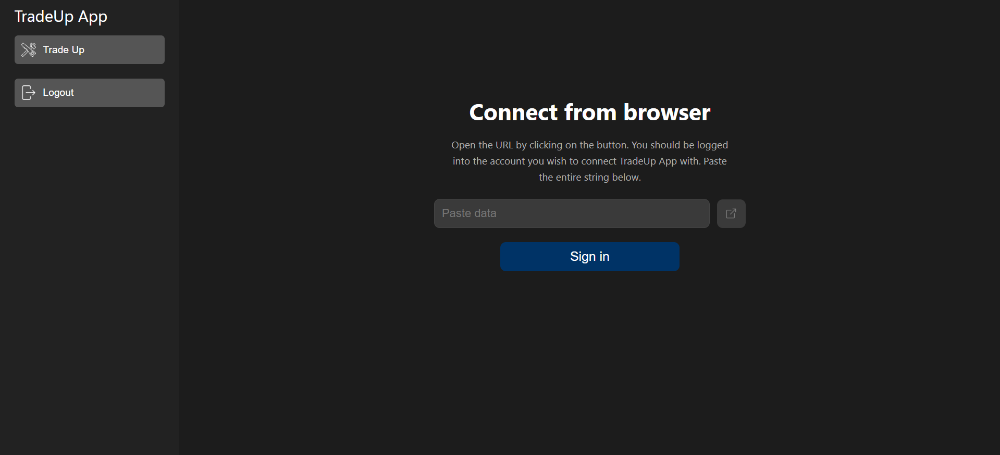
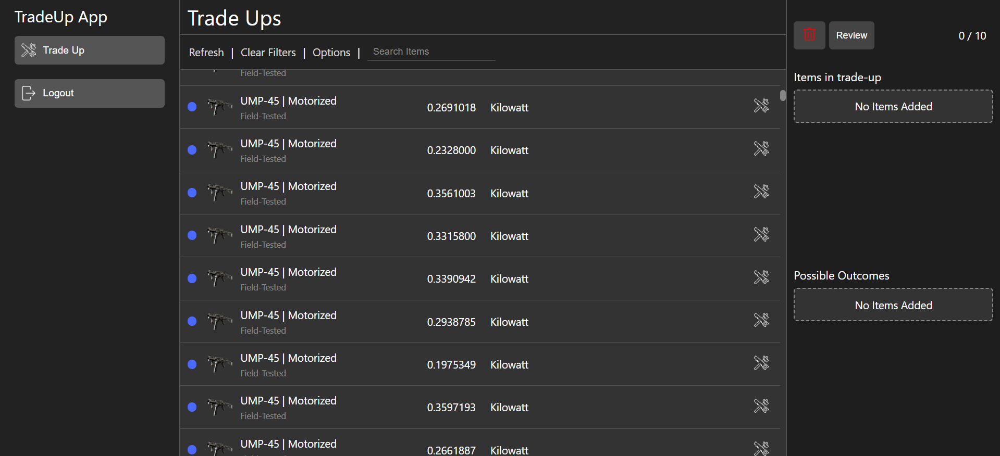
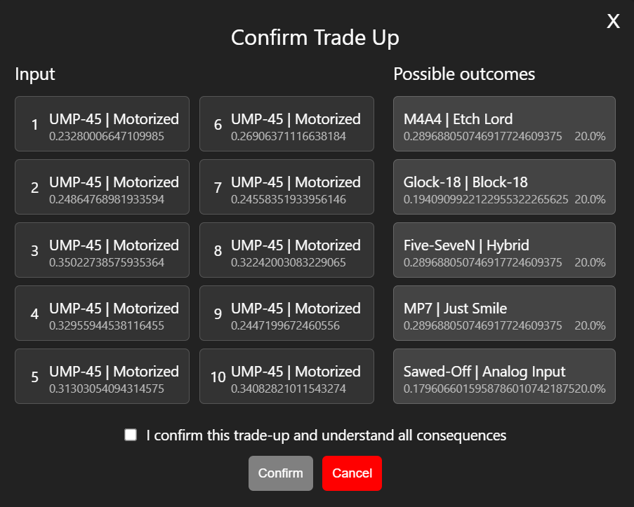
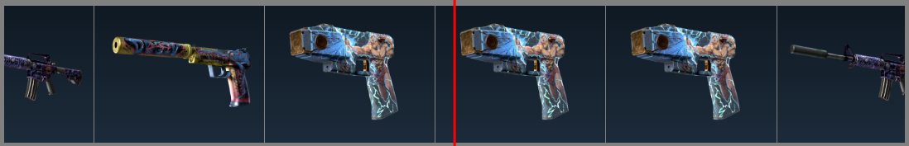

# Trade Up App

## Due to the recent update introducing knife contracts, the formula for calculating the output float value has also changed. As of now, the project is not functioning correctly.

This project is an MVP of a web application designed to facilitate trade-up contracts in CS2. It leverages the [node-globaloffensive](https://github.com/DoctorMcKay/node-globaloffensive) and [node-steam-user](https://github.com/DoctorMcKay/node-steam-user) libraries to manage game interactions. The frontend is built using Vue.js, while the backend is powered by Node.js.

## Features

- Calculates possible trade-up outcomes and their float values
- Saves completed trade-ups in file
- Transfer items from and to storages

## Get Started

1. Clone the repository:
```sh
git clone https://github.com/qordon/TradeUpApp.git
```
2. Install dependencies:
- To install the `concurrently` package globally for the project, run `npm install` in the root directory.
- Next, install the dependencies for the frontend and backend parts by running the following commands:
```sh
cd frontend
npm install
cd ../backend
npm install
```
3. To start both the UI and the server, run:
```sh
npm run start
```
4. Now navigate to `https://localhost:5173`.

## Showcase
<div style="margin-bottom: 25px; font-size: 16px; margin-left: 5px;">Login screen</div>

<div style="margin-bottom: 5px; font-size: 16px; margin-left: 5px;">Trade Ups Screen</div>

<div style="margin-bottom: 5px; font-size: 16px; margin-left: 5px;">Confirmation window</div>

<div style="margin-bottom: 5px; font-size: 16px; margin-left: 5px;">Roulette trade-up effect</div>



## To-do list

- Add roulette effect to trade-up ✅
- Improve calculating system for float values ✅
- Add logic for items float matching ✅
- Add storages features ✅

